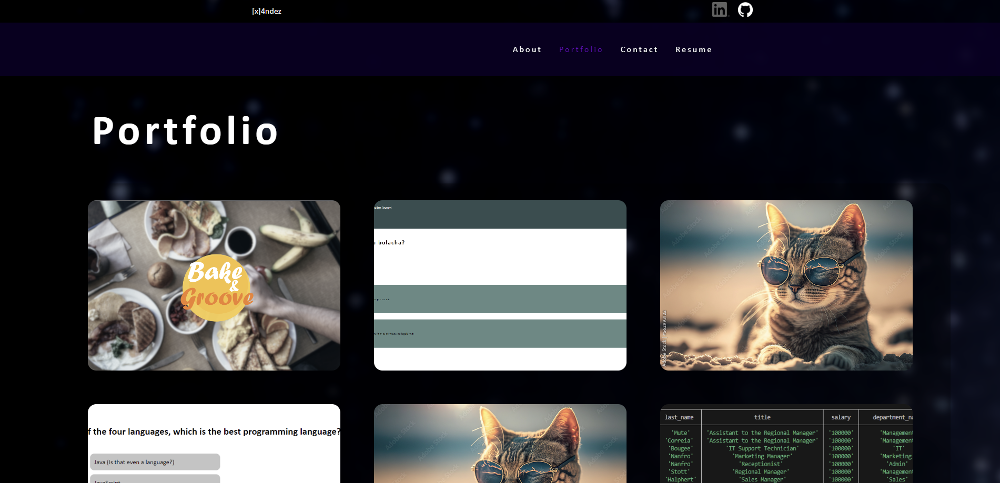

# Xande.reactfolio



## Description


## Table of Contents

1. [Developer Comments](#developer-comments)
2. [Deployed Application](#deployed-application)
3. [Usage](#usage)
4. [License](#license)
5. [Contribution](#contribution)
6. [Questions](#questions)

## Developer Comments


The acceptance criteria of this project were as follows:

```md

```

## Deployed Application
The deployed application can be viewed from the following link: <https://xande-portfolio.netlify.app/>.<br>

## Usage


## License
<br>
This project is covered under the MIT License.

## Contribution
x4ndez: <https://github.com/x4ndez>

## Questions
Questions may be directed to my LinkedIn: <https://www.linkedin.com/in/alexandernanfro/>.